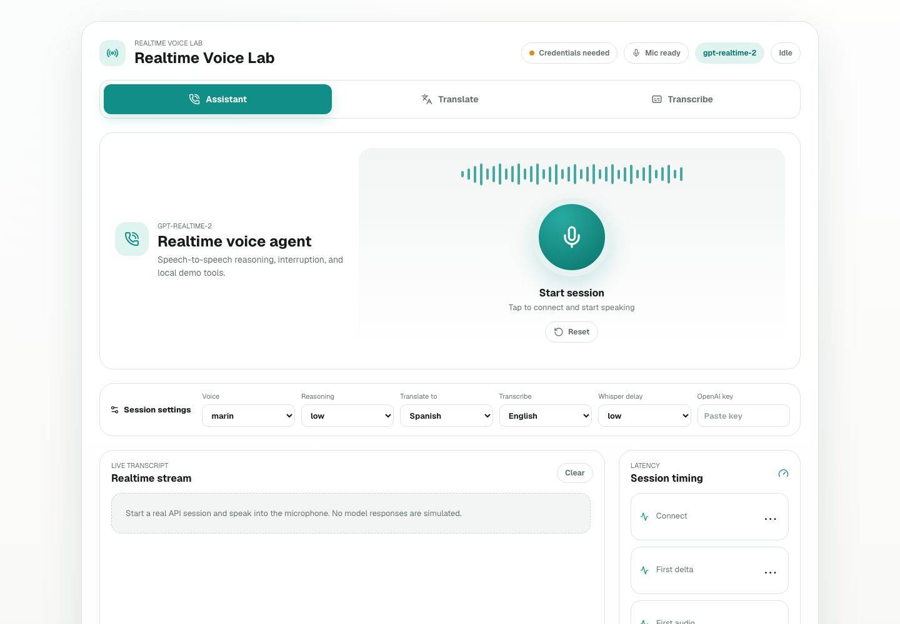
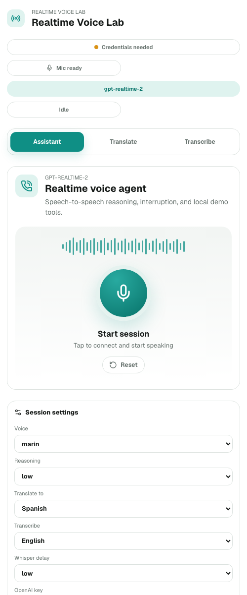

# OpenAI Realtime Voice Demo

A mobile-first Next.js demo for exploring OpenAI realtime voice models in the browser.

It includes three live workflows:

- **Voice assistant** with `gpt-realtime-2`
- **Live translation** with `gpt-realtime-translate`
- **Streaming transcription** with `gpt-realtime-whisper`

The app does not simulate model responses. It creates short-lived Realtime client secrets from server API routes and connects from the browser with WebRTC.

## Preview



<p align="center">
  
</p>

## Why This Exists

This project is a compact lab for testing what the realtime voice stack can do:

- Speech-to-speech assistant sessions
- Low-latency translated speech and subtitles
- Streaming transcript deltas
- Interruption-ready WebRTC sessions
- Basic latency readouts for connection, first delta, first audio, and turn completion
- Local mock tool calls for assistant demos

## How Credentials Work

This repo is designed for public, bring-your-own-key demos.

- Visitors enter their own OpenAI API key in **Session settings**.
- The browser stores the key only in the current tab with `sessionStorage`.
- The key is sent to this app's server only to create a short-lived Realtime client secret.
- The browser receives only that short-lived client secret for the WebRTC session.
- For local development, `.env.local` is supported as an optional fallback.

Do not deploy a public demo with your own production `OPENAI_API_KEY` unless you intend to pay for visitor usage.

## Quick Start

Install dependencies:

```bash
npm install
```

Run the development server:

```bash
npm run dev
```

Open:

```text
http://localhost:3000
```

Then paste your OpenAI API key into **Session settings** in the app.

You can also create `.env.local` for local development:

```bash
OPENAI_API_KEY=your_openai_api_key
```

## Scripts

```bash
npm run dev
npm run lint
npm run build
npm run start
```

## Deploy

Vercel is the simplest deployment target because this app uses Next.js app routes under `/api/session/*`.

For a public BYOK deployment:

- Do not set `OPENAI_API_KEY` in production.
- Let each visitor enter their own key in the app.
- Avoid request-body logging on the session API routes.

This app is not suitable for GitHub Pages because GitHub Pages cannot run the server API routes needed to create Realtime client secrets.

## Project Structure

```text
app/                     Next.js app routes and UI
app/api/session/*        Server routes that create Realtime client secrets
hooks/useRealtimeRtc.ts  Browser WebRTC helper for translation/transcription
lib/sessionConfig.ts     Model, language, voice, and instruction config
public/screenshots/      README screenshots
```

## Notes

- Assistant tool results use local demo data and are intentionally marked as `local-demo-tool`.
- Microphone permissions and audio autoplay behavior should be tested in a real browser.
- Realtime API availability and model names may change; check OpenAI documentation before production use.
